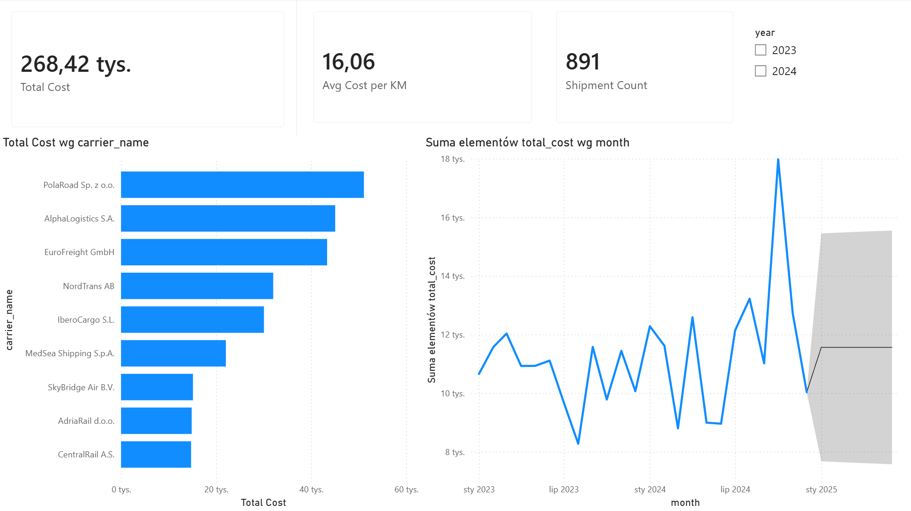
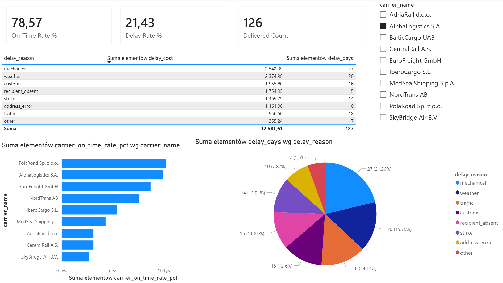

# Transport Cost Analytics Dashboard

End-to-end BI project for a fictional logistics company — from raw SQL schema to an interactive Power BI dashboard with forecasting.

**Pipeline:** PostgreSQL (schema + ETL + views) → Power BI (DAX measures + interactive dashboard)

---

## Dashboard Preview

**Page 1 – Cost Overview**


**Page 2 – Delivery Performance**


---

## Key Findings

| KPI | Value |
|---|---|
| Total freight cost (2023-2024) | 268 420 EUR |
| Average cost per km | 16.06 EUR/km |
| Active shipments | 891 |
| On-time delivery rate | 78.57% |
| Delay rate | 21.43% |
| Top carrier by cost | PolaRoad Sp. z o.o. |
| Leading delay cause | Mechanical failure (27 days lost) |

---

## Architecture

```
sql/
  01_schema.sql               # DDL: carriers, routes, shipments, costs, delays
  02_seed_carriers_routes.sql # Reference data: 10 carriers, 30 European routes
  03_seed_shipments_costs.sql # Fact data: 1 000 shipments, 1 000 costs, 140 delays
  04_quality_checks.sql       # Anomaly detection: NULLs, duplicates, out-of-range values
  05_cleansing.sql            # Data cleansing: imputation, deduplication, standardisation
  06_views.sql                # Analytical views: vw_cost_per_km, vw_on_time_rate,
                              #                   vw_monthly_trends, vw_kpi_summary

powerbi/
  transport_dashboard.pbix    # Power BI dashboard (Import mode)
  01_data_connection.md       # Data source setup
  02_data_model.md            # Relationships and schema design
  03_dax_measures.md          # All DAX measures with explanations
  04_page1_cost_overview.md   # Page 1 documentation and insights
  05_page2_delivery_performance.md  # Page 2 documentation and insights
  06_forecast_and_styling.md  # Forecast methodology and design decisions
  screenshots/                # Dashboard screenshots

docs/
  data_dictionary.md          # Full table and column reference
```

---

## Database Schema

| Table | Rows | Description |
|---|---|---|
| `carriers` | 10 | Logistics companies (road, rail, air, sea) |
| `routes` | 30 | European origin-destination pairs with distance (km) |
| `shipments` | 1 000 | Individual shipment records (weight, dates, status) |
| `costs` | 1 000 | Cost breakdown per shipment (fuel, toll, labour, other) |
| `delays` | 140 | Delay incidents with root cause and cost |

### Analytical views

| View | Purpose |
|---|---|
| `vw_cost_per_km` | Cost efficiency per shipment (cost/km, cost/kg) |
| `vw_on_time_rate` | Delivery performance with carrier and route on-time rates |
| `vw_monthly_trends` | Monthly aggregates: costs, volumes, MoM change, delay KPIs |
| `vw_kpi_summary` | Single-row executive summary for KPI cards |

---

## Power BI Dashboard

### Page 1 — Cost Overview
- **KPI cards:** Total Cost (268k EUR) | Avg Cost per KM (16.06) | Shipment Count (891)
- **Bar chart:** Total cost by carrier — PolaRoad leads, rail/air carriers significantly lower
- **Line chart:** Monthly cost trend 2023-2024 with 6-month ETS forecast (95% CI)
- **Slicer:** Year filter (2023 / 2024)

### Page 2 — Delivery Performance
- **KPI cards:** On-Time Rate % (78.57) | Delay Rate % (21.43) | Delivered Count (700)
- **Bar chart:** On-time rate by carrier
- **Table:** Delay breakdown by reason with cost and days lost
- **Pie chart:** Delay days distribution across 8 reason categories
- **Slicer:** Carrier filter

### DAX Measures
`Total Cost` | `Avg Cost per KM` | `Shipment Count` | `Delivered Count` | `On-Time Count` | `On-Time Rate %` | `Delay Rate %`

Full DAX code and explanations: [`powerbi/03_dax_measures.md`](powerbi/03_dax_measures.md)

---

## How to Run

### 1. Set up PostgreSQL

```bash
psql -U postgres -c "CREATE DATABASE transport_analytics;"
psql -U postgres -d transport_analytics -f sql/01_schema.sql
psql -U postgres -d transport_analytics -f sql/02_seed_carriers_routes.sql
psql -U postgres -d transport_analytics -f sql/03_seed_shipments_costs.sql
psql -U postgres -d transport_analytics -f sql/05_cleansing.sql
psql -U postgres -d transport_analytics -f sql/06_views.sql
```

### 2. Open Power BI

Open `powerbi/transport_dashboard.pbix` in Power BI Desktop.  
Update the data source: **Home -> Transform data -> Data source settings** -> change server to `localhost`, database to `transport_analytics`.

---

## Tech Stack


- **Database:** PostgreSQL 18
- **ETL:** Pure SQL (schema, cleansing, analytical views)
- **Visualisation:** Microsoft Power BI Desktop (Import mode, DAX measures, built-in forecasting)
- **Data:** Synthetic dataset, 1 000 shipments across 30 European routes, 9 carriers

---

## Author

Portfolio project — Transport Cost Analytics  
Contact: kutpiotr1@gmail.com
